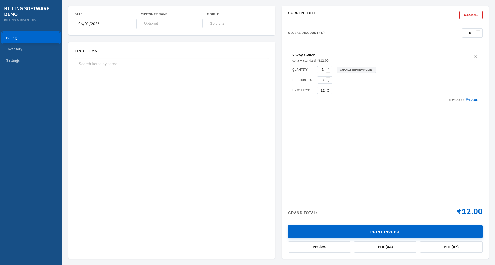
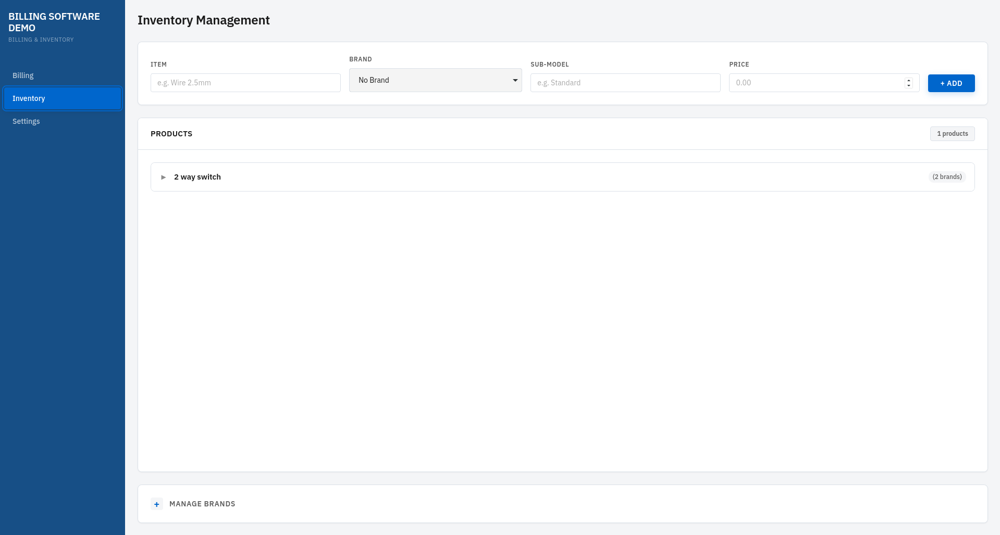
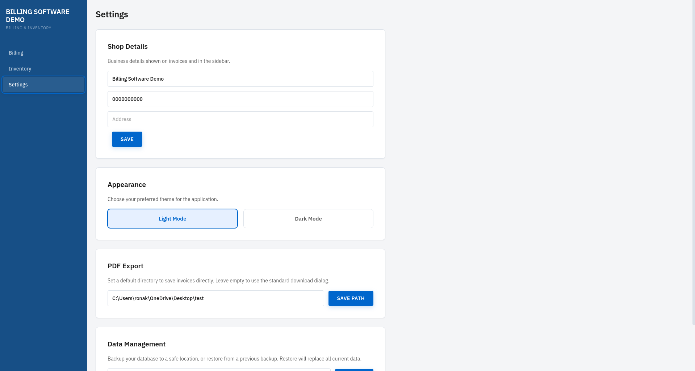

# Ronak Electricals — Billing & Inventory

Desktop app for inventory management, billing, and invoice generation at **Ronak Electricals**. Built with Tauri v2 + React 18.

## Tech

| Layer | Choice |
|-------|--------|
| Shell | Tauri v2 (Rust) |
| Frontend | React 18 + Vite 5 + TypeScript |
| Database | SQLite via `rusqlite` (Rust) with FTS5 search |
| Styling | CSS Modules (no Tailwind, no MUI) |
| PDF | `@react-pdf/renderer` (client-side) |
| Print | Native `window.print()` |
| Date | `dayjs` + `worldtimeapi.org` fetch with fallback |

## Features

- **Inventory** — Hierarchical products (Product → Brand → Sub-model) with inline editing
- **Billing** — FTS5-powered search, brand/sub-model variant picker, per-item & global discounts, cart snapshots
- **Invoice** — A4/A5 PDF export with `@react-pdf/renderer`, native print with print-specific CSS
- **Dark mode** — CSS custom properties theming
- **Backup/Restore** — Full SQLite database backup & restore from Settings
- **Invoice numbering** — Auto-incrementing sequential numbers, persisted in DB
- **Offline-first** — Zero backend, zero cloud, fully local

## Screenshots

| Billing | Inventory | Settings |
|---------|-----------|----------|
|  |  |  |

## Quick start

```bash
npm install
npm run tauri dev     # dev with hot reload
npm run tauri build   # production binary
```

## System requirements

- Node.js 18+
- Rust 1.77+
- Tauri v2 system deps (webkit2gtk, etc.)

## Architecture

```
┌─────────────────────────────────────────┐
│  React 18 (Vite)                        │
│  ┌──────────┐ ┌──────────┐ ┌─────────┐ │
│  │ Billing  │ │Inventory │ │Settings │ │
│  └────┬─────┘ └────┬─────┘ └────┬────┘ │
│       │            │            │       │
│  ┌────┴────────────┴────────────┴────┐  │
│  │  invoke() → Tauri Commands (Rust) │  │
│  └────────────────┬──────────────────┘  │
│                   │                     │
└───────────────────┼─────────────────────┘
                    │
          ┌─────────┴──────────┐
          │  SQLite (rusqlite) │
          └────────────────────┘
```

- **All DB access through Rust.** No JS SQLite library.
- **Cart is in-memory only** (`useState`), persisted to `localStorage` as a debounced snapshot.
- **No ORM.** Raw `rusqlite` queries.
- **No Redux/Zustand.** Only React built-in state.

## Keyboard shortcuts

| Shortcut | Action |
|----------|--------|
| `Ctrl+P` | Print invoice |
| `Ctrl+N` | Clear cart |
| `Ctrl+F` | Focus search |
| `Ctrl+D` | Focus global discount |
| `Escape` | Close modals / search results |

## Database

Auto-created at platform app-data directory. Schema initialized with `CREATE TABLE IF NOT EXISTS` on every launch. Migrations handled in Rust (`init_fts`, `migrate_old_items`).

## License

MIT
